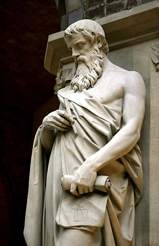
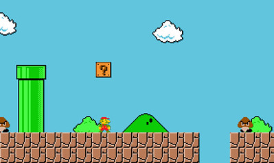
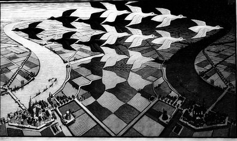

# What is Eucledian Geometry?

{ align=right }

In Ancient Greece, 300 BC, a man named Euclid of Alexandria was bored
and decided to spend his time writing down proofs regarding his observations between points in flat space.
The resultant book was called Euclid's Elements and formed the basis for what
we now know as Eculedian Geometry.

The opposite of Eucledian geometry, non-Eucledian Geometry, involves rationalizing over
non-flat space, with the major difference being parallel lines can intersect (we'll go over what this means later).
Intuitively Eucldedian geometry makes more sense and is easier to follow, which is how a guy way
back in 300 BC had the tools to come up with it.  However, special relativity showed that space
was not flat.  Space is bent by super massive objects and that bending causes gravity.  This isn't a physics 
lesson though, so we are fine to bend the laws of physics and work with completely flat space.

While Eucledian geometry may not be wholly realistic, it is wonderful for rationalizing about
the real world via abstraction.  Abstraction takes something really complex
and simplifies the details to create a model that is easier to think about.
Everything we know is an abstraction as it's impossible to fully model a complete system.
Let's do a quick activity to drive this point home.

!!!abstract "Activity"
    === "Acitivity Definition"
        Think about making your favorite dish.  What steps are involved?  Does it have to be made
        with the same ingredients, or can there be substituions?  Now think about writing down
        a recipe for your favorite dish.  Would you write down every step that you did, or
        can some steps be omitted--like washing your hands, taking out the ingredients, or cutting
        open a package?  Are the distributing brands important?  Which details are
        crucial and cannot be omitted?  Can any type of onion be used, or must it be a yellow?

    === "The Point"
        A recipe is an abstraction which allows you to share the knowledge of making your favorite dish.
        Within it you put all the things you deem necessary for someone to fully undertand your dish.
        If your recipe does not fully encapsulate your dish and you give it to someone to create then 
        they will fail to re-create it.  Therefore, it seems Euclid's geometry can be used as long
        as doing so doesn't abstract away enough of the crucial details.  

## Applications for Geometry

{align=left}
Computer Graphics: 
{align=right}
Architecture: 
{align=left}

## I'm Not a Visual Learner, Why Should I Learn Geometry?

